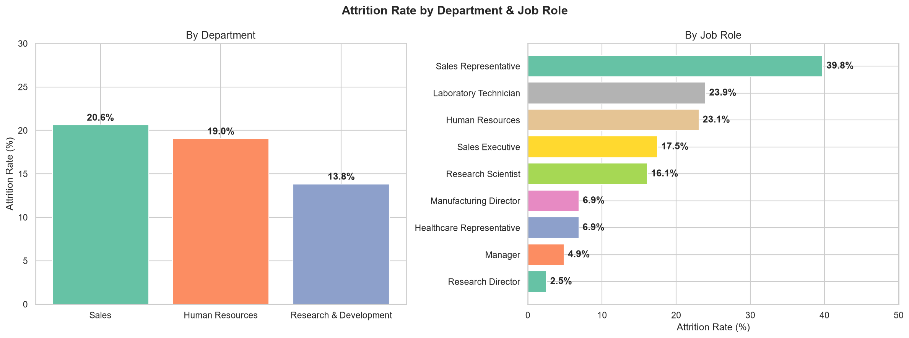
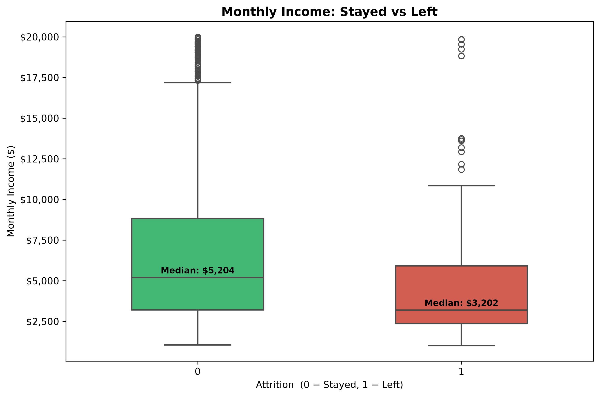
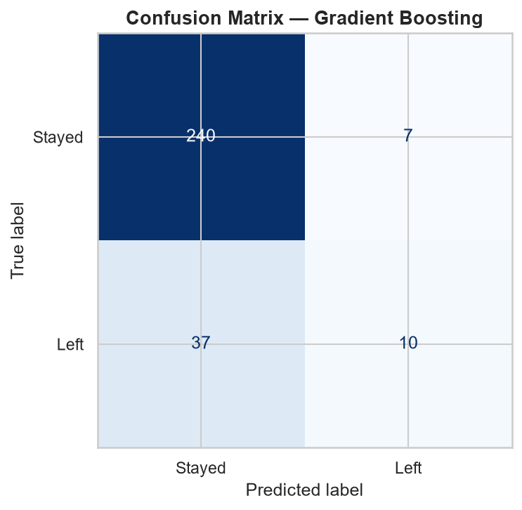
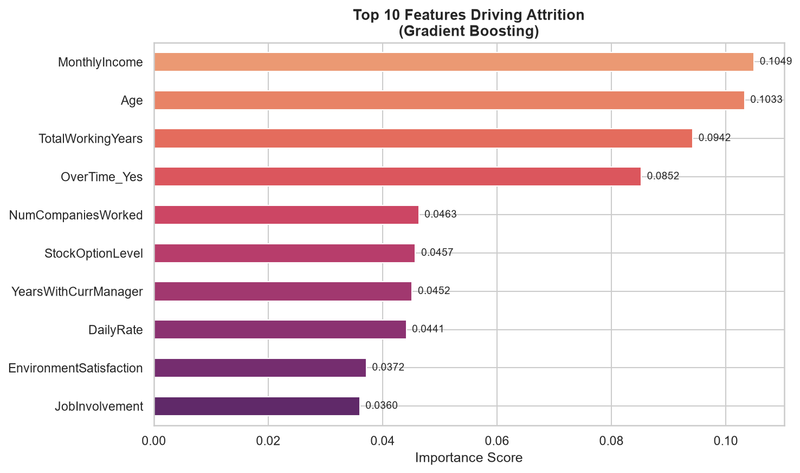
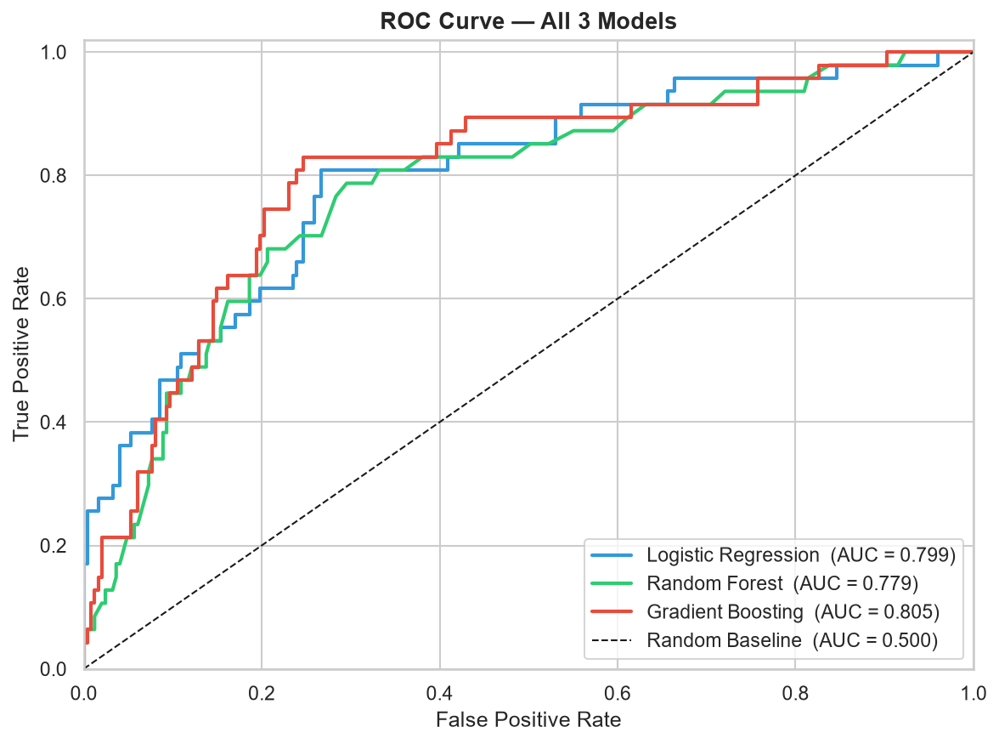

# HR Employee Attrition Analysis & Prediction



## Overview
Employee attrition is a significant challenge for many organizations, leading to increased hiring costs, lost productivity, and potential impacts on company culture. This project explores the **IBM HR Analytics Employee Attrition & Performance** dataset to identify the key drivers of employee turnover and build predictive models to forecast which employees are most likely to leave.

By understanding the underlying factors—such as income level, job role, and work-life balance—organizations can take proactive measures to improve employee retention.

## Key Features
* **Automated Data Retrieval**: Uses `kagglehub` to seamlessly fetch the dataset if it's not available locally.
* **Exploratory Data Analysis (EDA)**: Deep dive into the data to uncover trends across different departments and job roles.
* **Machine Learning Models**: Implementation of Logistic Regression, Random Forest, and Gradient Boosting Classifiers to predict attrition.
* **Performance Evaluation**: Comprehensive evaluation using Confusion Matrices, ROC-AUC curves, and Classification Reports.
* **Feature Importance**: Identifying which factors contribute most significantly to employee attrition.

## Insights & Visualizations

### 1. Attrition by Department & Job Role
We analyzed how attrition rates vary across different departments and specific job roles. 


### 2. Income Distribution
Monthly income plays a crucial role in employee retention. The boxplot below highlights the income disparity between employees who left and those who stayed.



### 3. Model Performance & Confusion Matrix
We trained multiple models to predict attrition. The confusion matrix below shows the performance of our best-performing model on the test dataset.



### 4. Feature Importance
What drives an employee to leave? According to our predictive model, these are the most critical factors influencing attrition decisions.



### 5. ROC Curve
The Receiver Operating Characteristic (ROC) curve evaluates the trade-off between the true positive rate and false positive rate for our models.



## Technical Stack
* **Python**: Core programming language
* **Pandas / NumPy**: Data manipulation and numerical operations
* **Matplotlib / Seaborn**: Data visualization
* **Scikit-Learn**: Machine learning model building, training, and evaluation

## Getting Started

1. **Clone the repository** and navigate to the project directory.
2. **Setup the Environment with UV**:
   This project uses `uv` for lightning-fast dependency management. Ensure you have `uv` installed, then run:
   ```bash
   uv sync
   ```
3. **Run the Analysis**: Open and run `analysis.ipynb` in your preferred Jupyter Notebook environment using the `.venv` created by `uv`. The script will automatically handle the dataset download if it is missing from your local directory.

## Conclusion
This analysis provides actionable insights into employee turnover. By focusing on the key features identified by the model (such as income, overtime, and specific job roles), HR departments can develop targeted strategies to improve retention and employee satisfaction.
